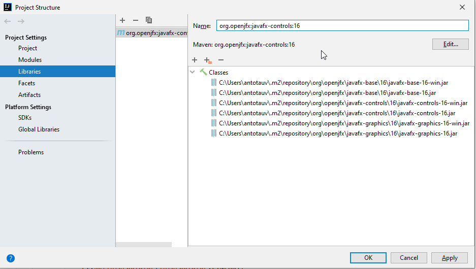
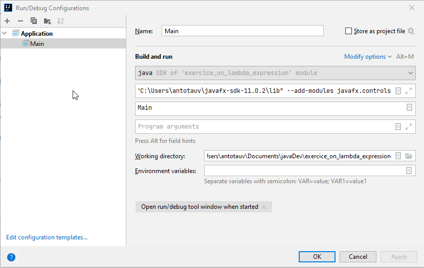

# Exercice sur les lambda expression.

## Instruction for the setup

### Part 1 : library

Warning : setup is not easy on this exercice because of the use of JavaFx.

First, git clone this project.

Then you need to add two libraries.
* **First lib** : in IntelliJ, goes to File / Project Structure
* On the Libraries settings, add a new Library from Maven.
* Look for _org.openjfx:javafx.controls:16_ and add it to your project.

* **Second lib** : in the same menu, add the downloaded Java library from the /lib directories.



### Part 2 : VM parameters

Now, the app should compile, but the run will cast an error like : JavaFX runtime component are missing.

Go to your run configuration, click on "Modify option" (in blue).
Add VM Option

On the VM Option, please add this options : 

`--module-path "C:\Users\antotauv\javafx-sdk-11.0.2\lib" --add-modules javafx.controls`

The module path should be adapted to your configuration.



## Exercice
Now the motorcycle is displayed on work with the Camera. 

Here's the exercice : by using stream function and lambda expression, 
make all part labelled as "RimFront" or "RimRear" or "TireRubberFront" to rotate.

A clue :
```
private void setInMotion(Node parts){
            RotateTransition rt = new RotateTransition();
            rt.setCycleCount(Integer.MAX_VALUE);
            rt.setAxis(Rotate.X_AXIS);
            rt.setByAngle(360);
            rt.setInterpolator(Interpolator.LINEAR);
            rt.setNode(parts);
            rt.setDuration(new Duration(1000));
            rt.play();
        }
```

Good luck !
